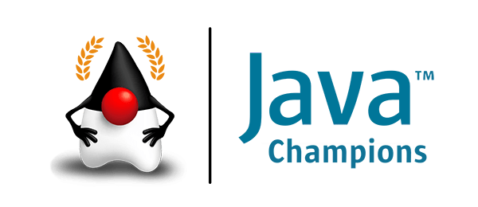
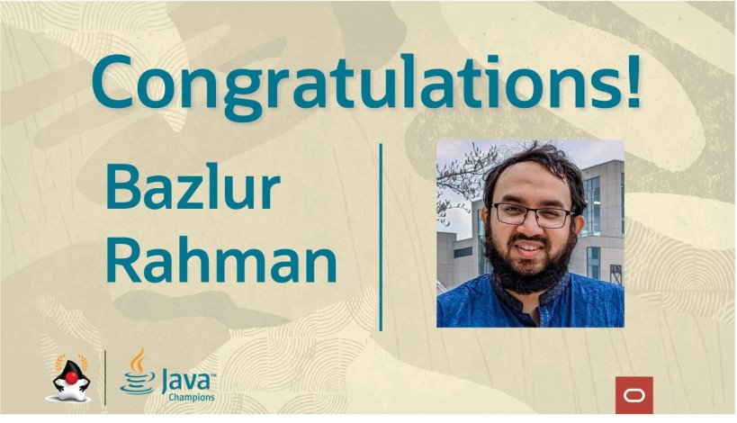

I'm now officially a Java Champion
==================================

A day couldn't be sweeter than this. Alhamdulillah!  
After 10 years of working on the Java platform, I'm now officially a **Java Champion**.  
  
Reference:  
<https://twitter.com/Java_Champions/status/1523728715368509440>  
<https://github.com/aalmiray/java-champions/blob/master/README.adoc>  

*** ** * ** ***

Type your email... {#subscribe-email}
