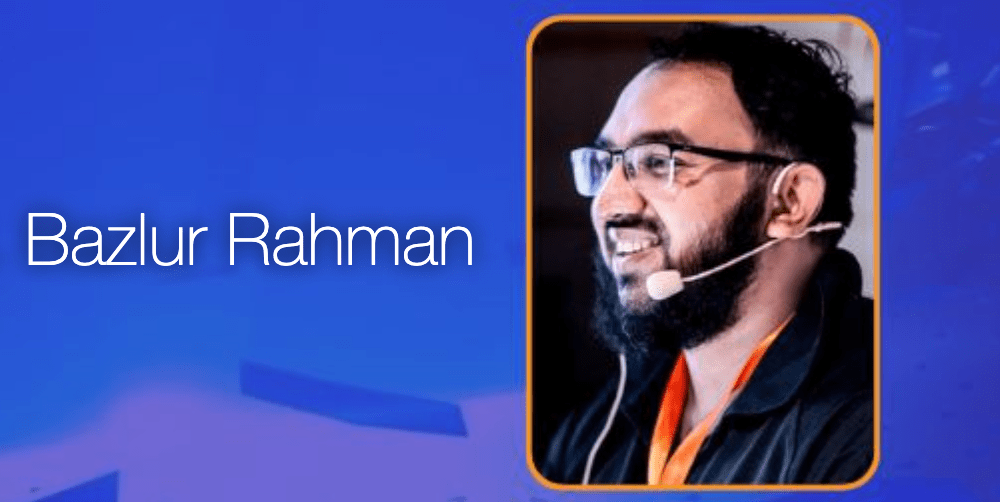

My Committer Profile and Interview with the Eclipse Foundation
==============================================================

I'm excited to share that the Eclipse Foundation interviewed me about my role as a committer for the Eclipse Starter for Jakarta EE project. We discussed my journey in open source, the challenges and rewards of being a committer, and the importance of contributing to open source projects.

The conversation touched upon my initial attraction to working in open source, which has always been a career milestone for me. I am grateful for the valuable learning opportunities and the chance to engage with a diverse community of contributors that open source projects offer. My involvement in the Eclipse Starter for Jakarta EE project has been an immensely rewarding experience, and I'm thankful to **[Reza Rahman](https://www.linkedin.com/in/javareza/)** for his guidance and support.

I invite you to read the full interview on the [Eclipse Foundation website](https://newsroom.eclipse.org/eclipse-newsletter/2023/march/committer-profile-anm-bazlur-rahman) and hope it inspires you to explore the world of open source!  

*** ** * ** ***

